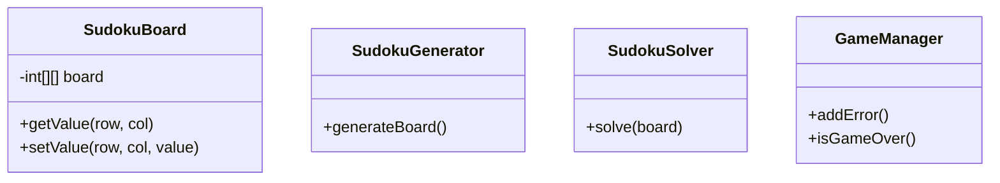
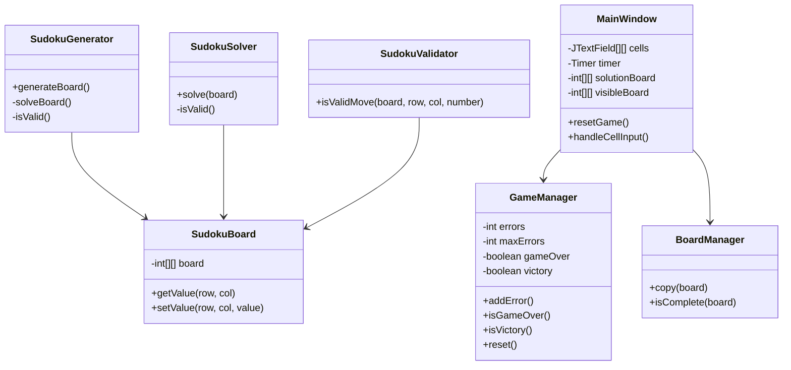

# sudoku-java-adrian
## 📌 UML — Class Diagram

El diagrama completo está en `docs/uml/class-diagram.md`, pero aquí tienes una vista rápida:

```mermaid
classDiagram
    class SudokuBoard {
        -int[][] board
        +getValue(row, col)
        +setValue(row, col, value)
    }

    class SudokuGenerator {
        +generateBoard()
    }

    class SudokuSolver {
        +solve(board)
    }

    class GameManager {
        +addError()
        +isGameOver()
    }
```

```mermaid
classDiagram
    class SudokuBoard {
        -int[][] board
        +getValue(row, col)
        +setValue(row, col, value)
    }

    class SudokuGenerator {
        +generateBoard()
        -solveBoard()
        -isValid()
    }

    class SudokuSolver {
        +solve(board)
        -isValid()
    }

    class SudokuValidator {
        +isValidMove(board, row, col, number)
    }

    class GameManager {
        -int errors
        -int maxErrors
        -boolean gameOver
        -boolean victory
        +addError()
        +isGameOver()
        +isVictory()
        +reset()
    }

    class BoardManager {
        +copy(board)
        +isComplete(board)
    }

    class MainWindow {
        -JTextField[][] cells
        -Timer timer
        -int[][] solutionBoard
        -int[][] visibleBoard
        +resetGame()
        +handleCellInput()
    }

    SudokuGenerator --> SudokuBoard
    SudokuSolver --> SudokuBoard
    SudokuValidator --> SudokuBoard
    MainWindow --> GameManager
    MainWindow --> BoardManager
```
