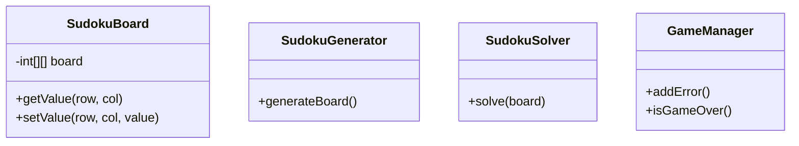
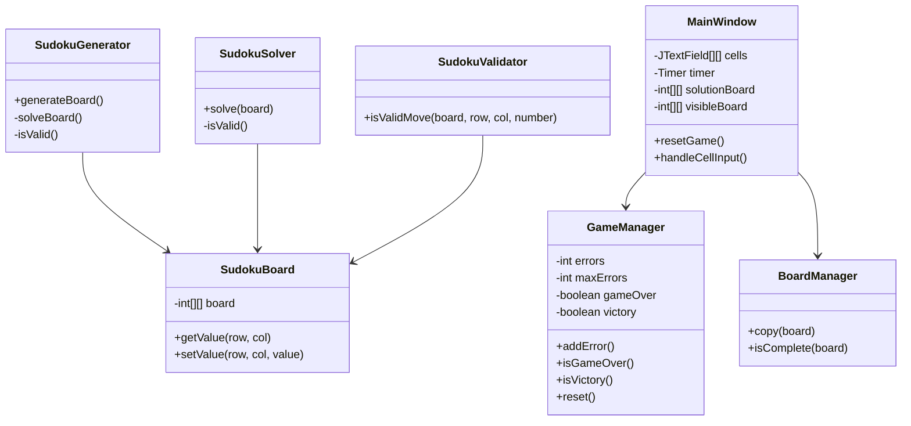
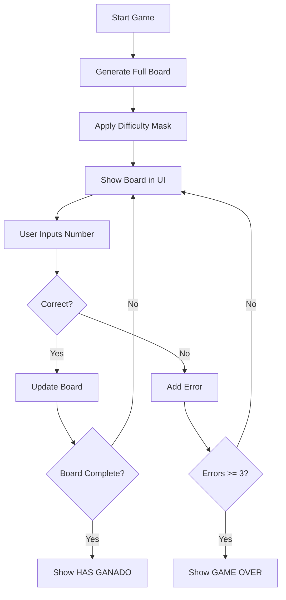

# 🧩 Sudoku Project — Java + Swing + GitFlow + CI/CD

Proyecto profesional de Sudoku desarrollado en **Java 21**, siguiendo buenas prácticas de **Entornos de Desarrollo**:

- Arquitectura limpia (model / service / ui)
- GitFlow real (main, develop, feature/*)
- Testing con JUnit 5
- Cobertura con JaCoCo
- CI/CD con GitHub Actions
- Documentación viva con Mermaid
- GitHub Pages para documentación
- Javadoc automático

---

## 🚀 Características del Juego

- Generación automática de Sudokus (Backtracking)
- Tres niveles de dificultad:
  - EASY → 30 casillas ocultas  
  - MEDIUM → 40 casillas ocultas  
  - HARD → 55 casillas ocultas  
- Validación en tiempo real
- Contador de errores (máximo 3)
- GAME OVER automático
- Detección de victoria
- Temporizador
- Botón “Resolver”
- Interfaz gráfica con Swing

---

## 📂 Estructura del Proyecto

sudoku-project/
│
├── docs/
│   ├── uml/
│   │   ├── class-diagram.md
│   │   └── activity-diagram.md
│   └── javadoc/
│
├── src/
│   ├── main/java/com/sudoku/
│   │   ├── model/
│   │   ├── service/
│   │   ├── ui/
│   │   └── Main.java
│   └── test/java/com/sudoku/
│
├── pom.xml
└── README.md

Código

---

## 🧠 UML — Class Diagram

🧪 Testing
JUnit 5

Tests incluidos:

SudokuValidatorTest

SudokuSolverTest

GameManagerTest

Ejecutar:

bash
mvn test
📊 Cobertura (JaCoCo)
Generar reporte:

bash
mvn test
Ver reporte:

Código
target/site/jacoco/index.html
⚙️ CI/CD — GitHub Actions
Incluye:

Compilación

Tests automáticos

Cobertura

Javadoc

Deploy a GitHub Pages

Workflow en:

Código
.github/workflows/ci.yml
🌐 GitHub Pages
Documentación disponible en:

Código
/docs
Incluye:

UML

Javadoc

Arquitectura

🧑‍💻 Tecnologías
Java 21

Swing

Maven

Git + GitHub

GitHub Actions

Mermaid

JUnit 5

JaCoCo

## 🔒 Branch Protection

La rama `main` está protegida:
- No se permiten pushes directos.
- Solo merges mediante Pull Requests.
- CI/CD debe pasar correctamente antes de integrar cambios.

La documentación completa del código está disponible en:

[docs/javadoc/](docs/javadoc/)
